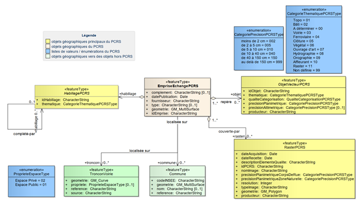
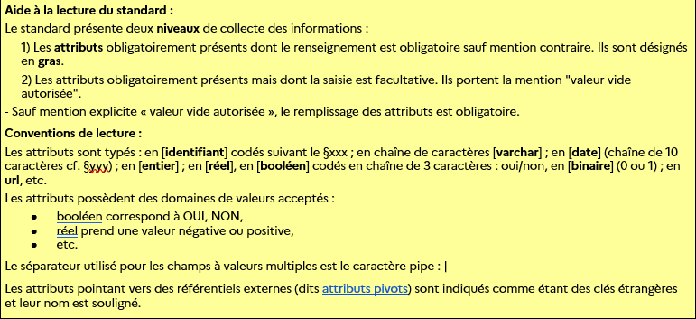

#  2. Fiche descriptive

| | |
|---|---|
| **Titre** | `<désignation officielle>` |
| **Sous-titre** | `<(facultatif) sous-titre>` |
| **Titre alternatif** | `<(facultatif) nom différent de la désignation officielle et sous lequel le standard est connu>` |
| **ID** | `<(facultatif) identifiant unique persistant pour identifier le contenu (URI)>` |
| **Version** | `<Version x.x - jj mois aaaa (date de publication)>` |
| **Résumé** | `<bref résumé du contenu>` |
| **Objectif** | `<(facultatif) informations sur les raisons qui motivent le développement du contenu (en particulier si le standard permet de répondre à une obligation réglementaire)>` |
| **Etendue d'application** | `<étendue des zones géographiques, temporelles ou verticales couvertes par le contenu>` |
| **Représentation spatiale** | `<(facultatif) la ou les formes de la représentation spatiale du contenu (Ex : données vectorielle, donnée image, mixte)>` |
| **Résolution spatiale** | `<(facultatif) facteur fournissant une compréhension générale de la densité des données spatiales/du niveau de référence (Ex : 1/50 000, 1m)>` |
| **Statut du document** | (`● <mettre le point dans l'étape correspondante`) Projet de standard en cours d'élaboration ()Appel à commentaires public organisé par le CNIG () Projet de standard proposé à la commission des Standards du CNIG () Standard validé par la Comission des standards du `<date>` |
| **Licence** | Le présent document est sous Licence Ouverte v2.0 (Open Licence) Etalab |
| **Diffusion** | `<lien vers la page du standard sur le site du CNIG et titre de la page> <lien vers la page référençant le standard sur schema.data.gouv.fr et la version minimale du schéma compatible>` |
| **Formats disponibles** | `<liste des formats sous lequel le document est disponible. Ex Word (.doc), Adobe PDF (.pdf)>` |
| **Restriction** | `<(facultatif) code(s) de classification décrivant les restrictions d'utilisation du contenu>` |
| **Thèmes** | `<code(s) de thématiques applicables au contenu, à prendre dans le thésaurus GEMET https://www.eionet.europa.eu/gemet/fr/themes/>` |
| **Mots clés** | `<(facultatif) termes formels ou expressions utilisés pour décrire l'objet du contenu>` |
| **Contact** | `<(facultatif) identification de la ou des personne(s) et organisme(s) associé(s) au standard, et un moyen de communiquer avec eux>` Formulaire de contact du CNIG : https://cnig.gouv.fr/spip.php?page=contact |
| **Informations complémentaires** | `<(facultatif) toute autre information descriptive sur le contenu et nécessaire à la fiche d'information, par exemple les référentiels (CARET, Sandre, Sar, etc.), normes et standards en lien (ceux que le standard remplace, les normes en lien, etc.). Lien vers github>` |

# Sommaire

:::toc
:::

#  3. Préface

##  3.1  Historique et suivi du document

| Version | Date | Chapitre modifié | Changement apporté |
| --- | --- | --- | --- |
| 1.0 | `<mois aaaa>` | - | Publication CNIG |
| `<x.x>` | `<mois aaaa>` | `<2.3.1>`  `<2.4>`  `<A.1.2>` | `<Description succinte du changement 1>`  `<Description succinte du changement 2>`  `<Description succinte du changement3>` |

##  3.2  Participation à l'écriture

Ce standard a été réalisé sous la coordination du groupe de tavail `<Nom du groupe de travail>` du CNIG, animé par `<Prénom NOM de l'animateur dudit groupe de travail CNIG>`. Sa création a été possible grâce au concours financier de `<noms des principaux financeurs (optionnel)>`. Ce standard a été rédigé par `<Prénom NOM du rédacteur>` (`<organisme du rédacteur>`) avec les contributions majeures de `<Prénom NOM (organisme)>`, `<Prénom NOM (organisme)>` et `<Prénom NOM (organisme)>`. Ce document a été relu par `<Prénom NOM (organisme) (optionnel)>`. Ce document a été validé par `<Organisme>` en complément de son adoption par le CNIG. 

Ont également participé aux travaux :

  `<Prénom NOM (organisme)>`-`<Prénom NOM (organisme)>`-`<Prénom NOM (organisme)>`-`<Prénom NOM (organisme)>`-`<Prénom NOM (organisme)>`

#  4. Présentation du document
 

##  4.1  Objectif et raison d'être du standard

`Le présent document est <...>`

`Son objectif est de <...>`

`Il se fonde en partie sur un besoin identifié durant <...>`

##  4.2  À qui s'adresse ce document ?

`Ce standard s'adresse à <...>.`

##  4.3  Comment lire le document

`Le contenu du présent standard est réparti dans X parties et comporte Y annexes.`

`La partie 1 constitue une préface qui synthétise les informations du standard. Elle permet de retrouver ...`

`La partie 2 présente une introdutcion au document, permettant de le contextualiser et de le comprendre.`

`La partie 3 est de niveau abstrait. Elle présente les concepts du référentiel et présente des potentiels cas d'utilisation.>`

`La partie 4 contient les recommandations, obligations ou permissions liées au standard.>`

`La partie 5 est plus opérationnelle : Elle décrit l'implémentation du standard.>`

`L'annexe A est informative et spécifie xxx.`

##  4.4  Références à d'autres normes

`<Ici le document s'appuie/nécessite la lecture d'autre normes. Toutes les sous parties sont (optionnelles)>`

  **Références normatives**

Ce document s’appuie ou nécessite la lecture des normes référencées ci-dessous. Pour les références datées ou versionnées, seule l'édition citée compte. Pour les autres, la dernière édition de la norme s'applique.

Normes référencées :

● `Directives ISO/IEC, Partie 1 - Procédures pour les travaux techniques - Supplément ISO consolidé - Procédures spécifiques à l’ISO, 13eme édition, 2022`
● `ISO xxxxx-x, Titre-Partie x: Titre de la partie`
● `ISO xxxxx-xx: 20xx, Titre-Partie xx: Titre de la partie`

  **Cadre réglementaire**
`<Ce document s'inscrit dns le cadre de la loi...>`

`<La mise en oeuvre de ce document est dcrite dans le règlement...>`

  **Standards CNIG**

`<Préciser ici les standards ainsi que les notions liées auquel il est fait référence dans le document.>`

  **Autres référentiels**

`<Préciser ici les référentiels tiers auxquels le standard se rapporte (comme le Sandre, le Sar, le Caret, etc.). Dans le cas où ces référentiels auraient été mis à jour pour assurer la compatibilité avec ce standard, préciser les modifications apportées et les versions correspondantes.>`

##  4.5 Compréhension du document

###  4.5.1  Termes spécifiques et définitions `<optionnel>`

|  | |
|---|---|
| `Terme 1` | `Définition du terme 1` | 
| `Terme 2` | `Définition du terme 2 Source : <lien vers la source>` | 

###  4.5.2  Abréviations `<optionnel>`

|  |  |
|---|---|
| `ADM` | `Abréviation du mot` |
| `ADM2` | `Abréviation du mot 2` |

#  5. Contexte d'application
`<Décrire l'objectif de l'utilisateur du standard. Donner des cas d'utilisation permis par le standard.>`

##  5.1  Périmètre d'application

`<Préciser ici le périmètre d'application du standard. Certaines exigences du standard peuvent n'être pertinentes que pour un périmètre d'application réduit à préciser ici.>`

`Ex : Ce standard s'applique à toutes les collectivités dispodant d'un document d'urbanisme.`
`Ce standard est destiné à être utilisé dans le cadre de la réforme DT/DICT.`

##  5.2  Les acteurs et rôles concernés `<optionnel>`

`Par leurs missions, les différents intervenants (ou utilisateurs) liés au thème peuvent être amenés à se reconnaître dans plusieurs rôles distincts. Ces rôles décrivent les besoins et les capacités de l'acteur.`

`Ces rôles peuvent sot décrit dans le schéma et le tableau ci-dessous.`

`<Schéma illustrant le parcours des données standardisées et le rôle des acteurs concernés. Ce parcours peut suivre l'un des exemples suivant : producteur/utilisateur/initiateur/serveur/receveur/facilitateur,             ou producteur/utilisateur/initiateur/diffuseur/facilitateur>`

| Rôles | Caractéristiques |
|---|---|
| `<**Nom du rôle 1**>` | `<description du rôle 1>` |
| `<**Nom du rôle 2**>` | `<descriptin du rôle 2>`  |

##  5.3  Cas d'utilisation `<optionnel>`

`<Si plusieurs cas d'utilisation existent, indiquer ici comment ils s'articulent>`

###  5.3.1.  Cas d'utilisation `<Nom du cas 1>` 

|  | `<Nom du cas 1>` |
|---|---|
| **Objectif** | `<(facultatif) Brève description de l'objectif à atteindre en réalisant le cas d'utilisation 1>` |
| **Déclencheur** | `<(facultatif) Evènement spécifique menant à l'exécution de ce cas d'utilisation 1>`  |
| **Précondition** | `<(facultatif) Description du statut requis pour lancer l'exécution du scénario d'utilisation>`  |
| **Postcondition** | `<(facultatif) Description du statut après exécution réussie du scénario d'utilisation>`  |

`<Diagramme UML du cas d'utilisation 1>`
`<Description rédigée du scénario d'utilisation>`

# 6. Contenu et structure de la donnée

`La section relative au contenu et à la structure des données décrit l'intégration du standard <objet du standard>.`

##  6.1.  Modèle conceptuel de données (MCD)

###  6.1.1.  Conventions de lecture
Le MCD est traduit sous forme graphique par (ou des) diagramme(s) de classe(s) UML.

###  6.1.2.  Diagrammes

`Exemple : Schéma applicatif UML du Standard PCRS général.`

##  6.2.  Catalogue d'objets

`<Un catalogue d'entités est un référentiel qui fournit la sémantique de tous les types d'entités, avec leurs attributs et leurs dommaines de valeur d'attribut, les types d'association entre les types d'entités et les opérations requises pour décrire la structure des données et leur contenu. Si un schéma d'application est disponible, le catalogue d'entités décrit l'ensemble des éléments qui le composent. De plus, les couvertures peuvent être considérées comme des entités ou bien être spécifiées à l'aide de descritpions de couverture.>`

`Exemples de catalogues d'objet :`

● `Ontologie des unités administratives de l'IGN :`
  `https://data.ign.fr/def/geofla/20210218.htm` ● `Description du type "Person" dans l'ontologie de Schema.org :`
  `https://schema.org/Person`

  `**CLASSE_1**`

|  |  |
|---|---|
| **Classe d'objet** | `**CLASSE_1**` |
| **Définition** |   |
| **Regroupement (facultatif)** | `<Les objets pouvant appartenir à la classe (par exemple : les objets dont la superficie est inférieure à 25m2 sont exclus)>`  |
| **Modélisation géométrique** |   |
| **Primitive graphique** |   |

| Attribut | Définition | Occurrences | Type | Contraintes | Exemples |
|---|---|---|---|---|---|
| `**classe_1_id**` | `identifiant de` | cf. codif. id §xxx  | `identifiant` | `clé primaire` |  |
| `**ban_id**` | `identifiant de l'adresse dans la BAN (Base Adresse Nationale)`  |  | `identifiant` | `clé étrangère` |  |
| `**att1**` |   |  | `entier` | `valeur obligatoire` |  |
| `**att2**` |   | `liste_att2` | `varchar` | `valeur obligatoire` |  |
| `**att3**` |   |  | `réel` | `valeur vide autorisée` |  |

`**CLASSE_2**`

##  6.3.  Description des tyes énumérés

Outres les valeurs désignées, tous les types énumérés comprennet les valeurs conventionnelles :

● "**Non renseigné**" pour exprimer : "inconnu, non renseigné, ou information non disponible",

● "**autre**".

###  6.3.1.  Listes de valeurs

| Type énuméré : `liste_att1-attribut de : CLASSE_1` |  |
|---|---|
| `valeur_1` | `valeur_3` |
| `valeur_2` | `valeur_4` |

| Type énuméré : `liste_att2-attribut de : CLASSE_1` |  |
|---|---|
|       |       |       |
|       |       |       |
|       |       |       |

###  6.3.2.  Définitions des valeurs

##  6.4.  Exemple de remplissage des tables

| CLASSE_1 |  | 
|---|---|
| classe_1_id |  |
| att1 |   |
| att2 |   |
| att3 |   |

| CLASSE_2 |  | 
|---|---|
| classe_2_id |  |
| att1 |   |
| att2 |   |
| att3 |   |

##  6.5.  Systèmes de référence

Les dernières évolutions des systèmes de référence mentionnés plus bas sont à trouver sur le site de l'IGN : https://geodesie.ign.fr/

| `Nom du périmètre d'application 1` |  |
|---|---|
| **Système de référence spatial** | `_Ex_` `_Plan: EPSG:3006(SWEREF 99 TM)_` `_Hauteur : EPSG:5613(RH 2000)_` |
| **Système de référence temporel** | `(facultatif)` `_Ex_` `_Calendrier grégorien, UTC_` |

# 7. Recommandations pour les données

##  7.1.  Qualité des données
Cette partie contient les recommandations et exigences de qualité concernant le contenu des données `<de la thématique>` de leur structuration.

###  7.1.1.  Enjeux
Il est important pour les producteurs et utilisateurs d’évaluer la capacité des données à pouvoir répondre à leurs attentes et besoins. Cette capacité est souvent dépendante de la qualité des données. La méconnaissance de leur qualité freine la mise à disposition de ressources (le fournisseur ayant peur d’exposer une donnée imparfaite), mais également la réutilisation des données (le ré-utilisateur potentiel n’ayant pas les moyens de vérifier que la ressource dispose d’une qualité suffisante pour l’usage souhaité).  

L’objectif est que le producteur puisse certifier la précision de la donnée afin de pouvoir la publier, puis que l’utilisateur en ait connaissance, qualifie et utilise la donnée en conséquence.  

Cette qualité peut être estimée, par exemple par des pourcentages de fiabilité ou des textes explicatifs : ils mesurent alors la qualité de la donnée.  

Ces mesures peuvent être : 

● Objectivables : Elles peuvent être transverses et communes à différents standards. Elles sont référencées par leur URls, disponibles dans [le registre national des mesures pour la qualification des données géographiques](https://data.geocatalogue.fr/ncl/mesuresQuaDoGeo/_incertitudeValAttS95). 

● Métiers : Il existe déjà en interne de la thématique des processus de production ou de gestion et ils peuvent être réutilisés pour mesurer la qualité des données de cette thématique.

Les différentes mesures de la qualité des données de `<la thématique>` sont définies ci-dessous et leurs résultats seront déclarés par les producteurs dans les métadonnées du produit (cf [Mesures de qualité complémentaires](bookmark://_heading=h.206ipza)). 

###  7.1.2.  Référence normative

La référence internationale est la [norme ISO 19157](https://www.iso.org/fr/standard/32575.html) sur la qualité des données géographiques. 

Néanmoins, pour définir au mieux les mesures de la qualité, vous pouvez vous référer aux documents nationaux :  

- les travaux du [groupe de travail CNIG sur la qualité des données géographiques](https://cnig.gouv.fr/ressource-quadogeo-a23521.html)
- la série de fiches méthodologiques du Cerema : [Qualifier les données géographiques - Un décryptage de la norme ISO 19157](https://www.cerema.fr/fr/actualites/serie-fiches-cerema-qualifier-donnees-geographiques)
- le registre national des mesures pour la qualification des données géographiques sur le [Géocatalogue](https://data.geocatalogue.fr/ncl/mesuresQuaDoGeo/_incertitudeValAttS95)

###  7.1.3.  Mesures de la qualité

#####  7.1.3.1.1.  `<Nom de la mesure>`
`<Explication/description de la mesure>` 

`<Justification de l’utilité de la mesure et explication claire de sa contrainte (pourquoi est-elle exigée ou recommandée ?)>` 

`<Comment effectuer/évaluer/calculer la mesure>` 

`<Exemple concret et le plus clair possible, en lien avec la thématique>`

`Pour approfondir, vous pouvez trouver <Lien vers la fiche du registre Géocatalogue/fiche CEREMA affiliée/fiche métier comme aide à la compréhension>.` 

#####  7.1.3.1.2.  `Exhaustivité (exemple)` 
`L’exhaustivité est la présence ou l’absence d’objets, d’attributs ou de relations dans le jeu de données par rapport au nombre total d’objets attendus.` 

`D’une manière générale on s’attend à trouver dans les lots de données la description de l’ensemble des ZAE. Cette mesure est obligatoire car si une zone manque, cela impactera directement la qualité du jeu de données.`  

`Le calcul correspond globalement à:`

`1-(Nombre d'objets en décalage/Nombre d'objetsattendus)`

`Le calcul précis et son explication sont détaillés dans la [fiche CEREMA « Critère d’exhaustivité ».](https://www.cerema.fr/fr/centre-ressources/boutique/qualifier-donnees-geographiques)` 

`Par exemple, le jeu de données ZAE devrait contenir 47 objets. Dans notre exemple, il comprend 50 objets : 5 sont en excédents, 2 sont manquants. Il y a donc 7 objets en décalage avec le nombre d’objets attendus. Le taux d’exhaustivité est alors égal à : 1 – (7/’47) soit : 85 %.` 

`Pour plus de précision, le [Géocatalogue](https://data.geocatalogue.fr/ncl/mesuresQuaDoGeo/_txEx) référence cette mesure (URI).`

####  7.1.3.2.  Mesures Recommandées
####  7.1.3.3.  Mesures Conditionnelles
###  7.1.4.  Seuils de qualité  
###  7.1.5.  Seuils exigés
`**Exemple: Seuil pour la mesure de l'exhaustivité**`
`**Le jeu de données doit respecter un seuil d'exhaustivité de 75%.` 
###  7.1.6.     Seuils recommandés
##  7.2.     Règles d'organisation et de codification
###  7.2.1.     Règles de codification des identifiants
**Les règles de codification suivantes doivent être respectées :**  

**Les valeurs vides sont codées “NULL” ou ne sont pas renseignées.** 

#  8. Cycle de vie des données
Le management de la donnée représente une vision de l’information, non pas comme un produit ex-nihilo, mais comme partie d’un système qui inclut les processus d’acquisition, de validation et d’actualisation de l’information. Cette approche systémique permet de penser la donnée comme ressource, dans son cycle de vie et ses potentielles réutilisations. 

##  8.1.  Acquisition des données
`<La section relative à l’acquisition de données vise à fournir des recommandations et/ou des descriptions de la saisie et de la production de données. Cela peut inclure des détails relatifs à des méthodes et/ou étapes de traitement spécifiques.>` 

`<Description rédigée en texte libre du processus d’acquisition et/ou de production des données>` 

##  8.2.  Validation des données

`<Indiquez dans ce paragraphe les moyens éventuellement mis en place pour contrôler vos lots de données (par exemple outils [validata.fr](http://validata.fr)) ou liés aux mesures de qualité précisées dans la partie 7.>` 

##  8.3.  Actualisation des données

`<Cette section vise à fournir des recommandations, descriptions, principes et/ou critères d’actualisation des données. Cela peut inclure les modes opératoires, la fréquence des modifications et/ou de la mise à jour.>` 

`<Décrivez les processus de maintenance recommandés.>`  

`<Décrivez les recommandations de mécanismes de SAV (par exemple signalement d’erreurs, de retours utilisateurs) s’ils sont connus au moment de l’écriture du standard.>` 

`<Décrivez les recommandations liées au versionnage.>` 

#  9. Règles de symbologie

`La section relative à la représentation graphique vise à spécifier comment présenter les types d'entités à des fins d'interprétation humaine, généralement à travers à un catalogue de représentations graphiques. Les légendes de cartes sous forme d'images peuvent être considérées comme des spécifications de représentation graphique.` 

`<Le catalogue de représentation graphique est spécifié dans la partie ci-dessous/ est disponible /en annexe/sur ce lien>.` 

##  9.1.  Symbologie 1

|  |  |
|---|---|
| `**ex**` | `Contient` |
|  |  |

#  10. Diffusion
`<Cette partie vise à fournir des instructions, des exigences, conventions d’échange et/ou des descriptions du format de diffusion des données et des moyens de livraison physique, ou bien des moyens de diffusion de données via des services de téléchargement ou d'affichage.>` 

#  11. Métadonnées
##  11.1.  Généralités

Chaque jeu de données doit obligatoirement être accompagné de ses métadonnées conformes (selon la réglementation applicable : INSPIRE, HVD, etc. et les bonnes pratiques en vigueur), afin de mettre en évidence les informations essentielles contenues et ainsi permettre la réutilisation des données.  

###  11.1.1.  Références
Ces consignes facilitent le catalogage des données et leur moissonnage par des outils dédiés. Elles s’appuient sur : 

- le « [Guide de saisie des éléments de métadonnées de données](http://cnig.gouv.fr/IMG/pdf/guide-de-saisie-des-elements-de-metadonnees-inspire-v2.0-1.pdf) » `v2.0, 2019`,
- le « [Guide Identificateurs de Ressource Uniques](http://cnig.gouv.fr/IMG/documents_wordpress/2016/02/GuideIRU-corrige-v2.pdf) » `v1.0.1 de février 2016`,
- le [guide technique européen pour l’implémentation des métadonnées de données et de services INSPIRE,](https://knowledge-base.inspire.ec.europa.eu/publications/technical-guidance-implementation-inspire-dataset-and-service-metadata-based-isots-191392007_en)
- [Validateur européen.](https://inspire.ec.europa.eu/validator/home/index.html)

###  11.1.2.  Périmètre INSPIRE
Les données `de la thématique sont / ne sont` pas référencées par INSPIRE. `Les catégories thématiques (“_topic category_”) sont :` 
`- ...`
  
##  11.2.  Eléments de métadonnées
###  11.2.1.  Consignes de nommage du fichier de métadonnées
|  |  |
|---|---|
| _**Consignes de nommage du fichier**_ (recommandation) | Le fichier de métadonnées est nommé: fr-<SIREN>-thème<date>.xml L’identificateur de la métadonnée pour les données du thème est constitué de deux blocs :
- bloc identifiant `le producteur / gestionnaire /autorité` : fr-<SIREN>
- bloc identifiant la donnée : -`thème`<date>      |
| Exemple | _Le nom du fichier de métadonnées du thème portant le numéro SIREN 422270515 publiées le 22 avril 2021, prend la forme :_  _fr-422270515-theme20210422.xml_    |

###  11.2.2.  Identification des données

|  |  |
|---|---|
| _**Intitulé de la ressource**_ (obligatoire)  |   L’intitulé contient le titre de la donnée avec une indication de la zone géographique. Il ne contient pas de millésime.     |
| Xpath ISO 19115  | identificationInfo[1]/*/citation/*/title     |
| Exemple   | *Données du `thème` de l'agglomération de Bordeaux*     |

|  |  |
|---|---|
| _**Résumé de la ressource**_ (obligatoire)  |    Le résumé doit décrire la ressource de façon compréhensible avec une définition commune et une indication géographique     |
| Xpath ISO 19115  | identificationInfo[1]/*/abstract     |
| Exemple   | *Données du `thème` de l'agglomération de Bordeaux. Ce lot est constitué conformément aux prescriptions du standard CNIG `thème` et fourni au `format`. (etc.)*     |

|  |  |
|---|---|
| _**Type de la ressource**_ (obligatoire)  |    Pour l'ensemble des lots concernés par ces consignes, le champ est à remplir avec la valeur : dataset. Certaines interfaces de saisie proposent « jeu de données ».      |
| Xpath ISO 19115  | hierarchyLevel      |
| Exemple   | *dataset*     |

       

|  |  |
|---|---|
| _**Localisateur de la ressource**_ (obligatoire)  |   Le localisateur est un lien vers un site permettant de décrire plus finement la ressource mais pouvant également permettre le téléchargement ou l’accès aux données ressources. Le localisateur est de préférence une URL (résolvable). Il peut y avoir plusieurs liens mais au moins un des liens doit être un accès public.       |
| Xpath ISO 19115  | transferOptions/*/onLine/*/linkage/URL      |
| Exemple de localisateur décrivant la ressource    | _http://cnig.gouv.fr/?page_id=`12345`_  _(page du site du CNIG contenant le lien vers le standard CNIG `thème`)_ |
| Exemple de service de téléchargement |  |
| Exemple de service de visualisation  |  | 

|  |  |
|---|---|
| _**Identificateur de ressource unique IRU**_ (obligatoire)  |   L’identificateur de ressource unique identifie la ressource elle-même (série de données ou service)        |
| Xpath ISO 19115  | identificationInfo[1]/*/citation/*/identifier/*/code   |
| Exigence     | L'IRU doit être conforme aux guides CNIG relatifs à la saisie des éléments de métadonnées INSPIRE : - « Guide de saisie des éléments de métadonnées INSPIRE » - « Guide Identificateurs de Ressource Uniques » |
| Remarque | Le champ IRU est "répétable" : il est possible de renseigner plusieurs IRU dans une fiche de métadonnées.  |

|  |  |
|---|---|
| _**FileIdentifier**_ (recommandé)  |   Le champ fileIdentifier est utilisé par tous les catalogues de métadonnées (en particulier par le Géocatalogue) comme identifiant de la fiche de métadonnées et est donc requis pour que la métadonnée soit déposée in fine sur le Géocatalogue. Il doit être unique quelque-soit l’outil utilisé pour produire la fiche de métadonnées et peut prendre l’une des deux formes suivantes : - identique aux règles de nommage du fichier de métadonnées (sans l’extension .xml) - UUID aléatoirement généré par certaines plates-formes        |
| Remarque   | L'IRU est un champ de métadonnées prescrit par Inspire, il identifie la ressource elle-même (série de données ou service). Le fileIdentifier est un champ technique imposé par l'utilisation du protocole CSW, il identifie la fiche de métadonnées dans le catalogue.    |
| Xpath ISO 19115 | fileIdentifier  |
| Exemple  1 : Recommandation règle de nommage  | _fr-422270515-`thème`20210422.xml_  |
| Exemple 2 : UUID   | _FEB67BA6-DFCE-4DAA-4515-70E77CAB4C44_   |

|  |  |
|---|---|
| _**Langue de la ressource**_ (obligatoire)  |   Le champ est à remplir avec le code à trois lettres de la langue de la ressource. Les documents d'urbanisme en France doivent obligatoirement être rédigés en français, le champ est à remplir avec la valeur : fre Ce code à trois lettres, conforme aux prescriptions de saisie de métadonnées INSPIRE, provient de la liste normalisée : http://www.loc.gov/standards/iso639-2/php/code_list.php       |
| Xpath ISO 19115  | identificationInfo[1]/*/language  |
| Exigence  | _fre_  |

|  |  |
|---|---|
| _**Encodage**_ (obligatoire)  | Le champ est à remplir avec les valeurs suivantes : - format d'échange (format de distribution) - version de format. Si le numéro de version n’est pas connu, la valeur par défaut sera « inconnue »    |
| Xpath ISO 19115  | distributionInfo/*/distributionFormat/*/name distributionInfo/*/distributionFormat/*/version  |
| Exemple   | `_format_` `_version_` |

|  |  |
|---|---|
| _**Encodage des caractères**_ (obligatoire)  | Il s’agit de l’encodage des caractères utilisé dans le lot de données |
| Xpath ISO 19115  | identificationInfo[1]/*/characterSet  |
| Remarque   | Le format `format` impose l'encodage utf8  |
| Exigence    | utf8   |

|  |  |
|---|---|
| _**Type de représentation géographique**_ (obligatoire)  | Pour l'ensemble des lots concernés par ces consignes, le champ est à remplir avec la valeur : vector (traduction de « vecteur »)  |
| Xpath ISO 19115  | identificationInfo[1]/*/spatialRepresentationType |
| Exigence  | _vector_  |

###  11.2.3.  Classification des données et services géographiques
|  |  |
|---|---|
| _**Catégorie thématique**_ (obligatoire)  | Le champ est à remplir avec la valeur suivante : `theme` (traduction de « `...` ») (liste : https://inspire.ec.europa.eu/metadata-codelist/TopicCategory  )  |
| Xpath ISO 19115  | identificationInfo[1]/*/topicCategory  |
| Exigence  | `_thème_`  |

###  11.2.4.  Mots-clés
|  |  |
|---|---|
| _**Mots clés obligatoires**_  | Le champ est à remplir avec - la désignation du thème :  `thème` ensuite avec les mots-clés permettant aux systèmes d'informations d'identifier le lot de données : - code SIREN de l’autorité compétente : Mot clé : <code SIREN> Nom du thésaurus : Répertoire SIRENE Date de publication : 20aa-mm-jj   |
| Xpath ISO 19115  | identificationInfo[1]/*/descriptiveKeywords/*/keyword identificationInfo[1]/*/descriptiveKeywords/*/thesaurusName   |
| Exemple  | `_thème_` _422270515_ _Répertoire SIRENE_ _2021-10-30_   |

|  |  |
|---|---|
| _**Mots clés libres**_  | Ces mots-clés ne doivent pas être saisis ensemble dans un mot-clé unique mais dans des mots-clés séparés |
| Exigence | données ouvertes |
| Remarque 1 | un séparateur est inutile, car il y a un mot-clé par balise. |
| Remarque 2 | D’après : http://cnig.gouv.fr/wp-content/uploads/2014/01/Guide-de-saisie-des-%C3%A9l%C3%A9ments-de-m%C3%A9tadonn%C3%A9es-INSPIRE-v1.1-final-light.pdf#page=18 : 
« Dans le cas de données sous licence ouverte, il convient d’ajouter un mot-clé ‘données ouvertes’. »  |

###  11.2.5.  Situation géographique
|  |  |
|---|---|
| _**Rectangle de délimitation géographique**_ (obligatoire)  | Pour l'ensemble des lots concernés, le rectangle de délimitation est défini par les longitudes est et ouest et les latitudes sud et nord en degrés décimaux, avec une précision d’au moins deux chiffres après la virgule. Les coordonnées sont exprimées en WGS84  |
| Xpath ISO 19115  | identificationInfo[1]/*/extent/*/geographicElement/*/westBoundLongitude identificationInfo[1]/*/extent/*/geographicElement/*/eastBoundLongitude identificationInfo[1]/*/extent/*/geographicElement/*/southBoundLatitude >identificationInfo[1]/*/extent/*/geographicElement/*/northBoundLatiTude  |
| Exemple | _O : -4.24_  _S : 41.34_  _E : 10.81_  _N : 50.79_  |
| Exigences | Les coordonnées sont exprimées en WGS84 On utilise le point comme séparateur décimal, et non la virgule   |

|  |  |
|---|---|
| _**Référentiel de coordonnées**_ (obligatoire)  | Pour l'ensemble des lots concernés par ces consignes, le champ est à remplir avec le système de coordonnées des données, avec utilisation du code EPSG ou du registre IGN-F.   |
| Xpath ISO 19115  | referenceSystemInfo/*/referenceSystemIdentifier/*/code   |
| Code xml  | <gmx:Anchor xlink:href="http://www.opengis.net/def/crs/EPSG/0/2154">EPSG:2154</gmx:Anchor> ou : <gmx:Anchor xlink:href="http://registre.ign.fr/ign/IGNF/crs/IGNF/RGF93LAMB93">IGNF:RGF93LAMB93</gmx:Anchor>   |  
| Exemple  | Pour la métropole avec code EPSG : http://www.opengis.net/def/crs/EPSG/0/2154 Pour l'outre-mer (La Réunion) avec registre IGN-F : http://registre.ign.fr/ign/IGNF/crs/IGNF/RGR92UTM40S   |

###  11.2.6.  Références temporelles
|  |  |
|---|---|
| _**Dates de référence**_ (obligatoire)  | Le champ Date est à remplir avec la valeur de la date de dernière actualisation du lot de données. Le champ Type de date est à remplir avec la valeur « création » lors de la première constitution du lot, puis la valeur « révision » pour les versions ultérieures.  |
| Xpath ISO 19115  | identificationInfo[1]/*/citation/*/date[./*/dateType/*/text()='revision']/*/date  |
| Exemple  | _2021-04-22_  Type de date : _création_ (la première fois) / _révision_ (les fois suivantes)  |

###  11.2.7.     Généalogie et résolution spatiale
|  |  |
|---|---|
| _**Généalogie**_ (obligatoire)  | Le champ est à remplir avec un texte faisant état de l’historique du traitement et/ou de la qualité générale de la série de données géographiques, on mentionnera les éléments suivants : - le référentiel source de la géométrie - la version du standard de référence - le numéro de version du lot et sa durée de vie. - etc.   |
| Xpath ISO 19115  | dataQualityInfo/*/lineage/*/statement Note : L’élément scope>level doit être fixé à « dataset ».   |
| Exemple  | _Données de `thème` de l'agglomération de Bordeaux. Ce lot de données produit a été numérisé à partir du référentiel géométrique `référentiel`, millésime `millésime` en suivant le processus `processus`, avec les moyens matériels suivants `moyens`_  |

|  |  |
|---|---|
| _**Résolution spatiale**_ (obligatoire)  | Le champ est à remplir avec la valeur entière correspondant au dénominateur de l’échelle. Ce dénominateur est celui de l’échelle du plan de référence pour la production du document numérique ou la plus petite échelle (le plus grand dénominateur) des différents plans ayant servi à la production des documents numériques.   |
| Xpath ISO 19115  | identificationInfo[1]/*/spatialResolution/*/equivalentScale/*/denominator  |
| Exemple  | *5000* (dans le cas d’une échelle 1/5000)   |

###  11.2.8.  Mesures de qualité complémentaires
Pour chaque mesure de la qualité (cf. [§Partie Qualité des données](bookmark://_heading=h.kgcv8k)), faire apparaître les champs suivants : 

|  |  |
|---|---|
| _**Identifiant de la mesure**_ (obligatoire)  | On indique l’URI de la mesure dans le Registre des mesures liées à la Qualité de Données Géographiques  |
| Xpath ISO 19115  | dataQualityInfo/*/report/*/measureIdentification/*/code  |
| Exemple  | *https://data.geocatalogue.fr/ncl/mesuresQuaDoGeo/txEx*  |

|  |  |
|---|---|
| **Résultat**  | Il s'agit du résultat de la mesure qualité effectuée sur le jeu de données. Le champ est à remplir avec les sous éléments suivants : - Type de valeur : Type du résultat (Integer pour un résultat numérique, Double pour un nombre flottant et String pour une chaîne de caractère) - Unité de mesure : Unité de mesure du résultat (Unity pour un nombre sans unités, meter pour un résultat en mètres, percent pour un pourcentage) - Valeur : Valeur du résultat (Par exemple pour un taux d’exhaustivité de 85,5%, la valeur sera 85,5)   |
| Xpath ISO 19115  | dataQualityInfo/*/report/*/result/*/valueType dataQualityInfo/*/report/*/result/*/valueUnit dataQualityInfo/*/report/*/result/*/value   |
| Exemple  | *Double*  *percent*  *85,5*   |

###  11.2.9.  Conformité
|  |  |
|---|---|
| _**Spécification**_ (obligatoire)  | On indique la conformité au standard CNIG et au `format` Le champ est à remplir avec les éléments suivants : - titre : référence du standard sous la forme : CNIG `thème` - date : date de validation du standard sous la forme AAAA-MM-JJ - type de date : publication - titre : référence du format sous la forme : `format` - date : version du format sous la forme AAAA-MM-JJ - type de date : publication   |
| Xpath ISO 19115  | dataQualityInfo/*/report/*/result/*/specification |
| Exemple  | _CNIG  `thème et version du standard`_  _2021-12-21_  _publication_  _`format`_  _v2.2_  _publication_   |

|  |  |
|---|---|
| _**Degré**_  | Il s'agit du degré de conformité des données avec les spécifications. Pour l’ensemble des lots concernés par ces consignes, le champ est à remplir avec les valeurs : true (en cas de conformité) / false (en cas de non conformité).  La balise est laissée vide en cas de non évaluation de la conformité.  Le degré est considéré comme « non évalué » si le champ n’est pas présent.   |
| Xpath ISO 19115  | dataQualityInfo/*/report/*/result/*/pass   |
| Exigence   | true / false / ou champ laissé vide  |
| Exemple  | *true* |

###  11.2.10.     Contraintes en matière d’accès et d’utilisation 
|  |  |
|---|---|
| _**Conditions applicables à l’accès et à l’utilisation**_  | Le champ est à remplir avec les mentions concernant : - les contraintes légales - les contraintes de sécurité - les contraintes d'usage    |
| Xpath ISO 19115  | Condition d’accès et d’utilisation : identificationInfo[1]/*/resourceConstraints/*/useLimitation Restriction d’accès public : identificationInfo[1]/*/resourceConstraints/*/accessConstraints=’otherRestrictions’ et : identificationInfo[1]/*/resourceConstraints/*/otherConstraints   |
| Recommandation | Contraintes d'usage : *Licence ouverte v2.0* Contraintes d’accès : *Pas de restriction d’accès public*  |

###  11.2.11.  Organisation responsable de la ressource 
|  |  |
|---|---|
| _**Organisme responsable de la ressource**_  | Le champ est à remplir avec : - l’organisme propriétaire de la donnée, une adresse mail générique de contact : Il doit s’agir d’une adresse mail institutionnelle, en aucun cas nominative. A défaut d’adresse mail, indiquer l’URL du formulaire de contact de l’organisme propriétaire de la donnée. - Le rôle de cet organisme : owner (traduction de « propriétaire »)    |
| Xpath ISO 19115  | identificationInfo[1]/*/pointOfContact/*/organisationName identificationInfo[1]/*/pointOfContact/*/contactInfo/*/address/*/electronicMailAddress identificationInfo[1]/*/pointOfContact/*/role   |
| Exemple  | *Bordeaux Métropole*  |
| Exemple  | *https://www.bordeaux-metropole.fr/Metropole/Bordeaux-Metropole-a-votre-service/Contacter-Bordeaux-Metropole*  |
| Exemple  | *owner*   |

Métadonnées concernant les métadonnées 

|  |  |
|---|---|
| _**Point de contact pour la métadonnée**_  | Le champ est à remplir avec le nom de l’organisation : - l’organisme de contact (même s’il est identique à l'organisme responsable de la ressource) - une adresse mail générique de contact : Il doit s’agir d’une adresse mail institutionnelle non nominative.A défaut d’adresse mail, indiquer l’URL du formulaire de contact de l’organisme propriétaire de la donnée. - La nature de cette adresse : pointOfcontact (traduction de « Point de contact »)   |
| Xpath ISO 19115  |contact*/organisationName contact/*/address/*/electronicMailAddress contact/*/role |
| Exemple   | *Bordeaux Métropole*  |
| Exemple  | *https://www.bordeaux-metropole.fr/Metropole/Bordeaux-Metropole-a-votre-service/Contacter-Bordeaux-Metropole*  |
| Exigence    | *pointOfContact*   |

|  |  |
|---|---|
| _**Date des métadonnées**_  | Date à laquelle l’enregistrement des métadonnées a été fait ou révisé Elle est exprimée sous la forme AAAA-MM-JJ   |
| Xpath ISO 19115  | dateStamp   |
| Exemple   | *2021-04-29*   |

|  |  |
|---|---|
| _**Langue des métadonnées**_  | Langue des métadonnées. Cet élément prend la valeur fre pour « français »   |
| Xpath ISO 19115  | language |
| Exemple   | *fre*  |

|  |  |
|---|---|
| **Nom du format**  | Contient le nom d'un support de données  |
| **Encodage**  | contient le nom complet de la norme de codage des caractères utilisée  <u>Xpath ISO 19115</u> : MD_CharacterSetCode  |
| **Version**   | (facultatif) Contient une chaîne d'identification de version du format de données (date, numéro, etc.)   |
| **Spécification**   | (facultatif) Contient le nom d'un sous-ensemble, d'un profil ou d'une spécification de produit du format  |
| **Structure**   | (facultatif) Contient la structure d'un fichier de livraison   |
| **Langue**   | (facultatif) Chaque occurrence contient un code pour les langues utilisées dans la livraison  <u>Xpath ISO 19115</u> : LanguageCode   |

#  12.  Informations additionnelles `<optionnelle>`

# Annexe A `<optionnelle>``<**Titre de l’annexe** >` 

`**Normative/Informative**`

**A.1.**  `<**Titre** >` 

  **A.1.1.**  `<**Titre** >` 

# Bibliographie

1. **Ressources documentaires** 

**Nom, Prénom. 2011.** *Nom du livre.* s.l. : Editions, 2011. numéro ISBN/ISSN. 

2. **Points de contacts additionnels** 
