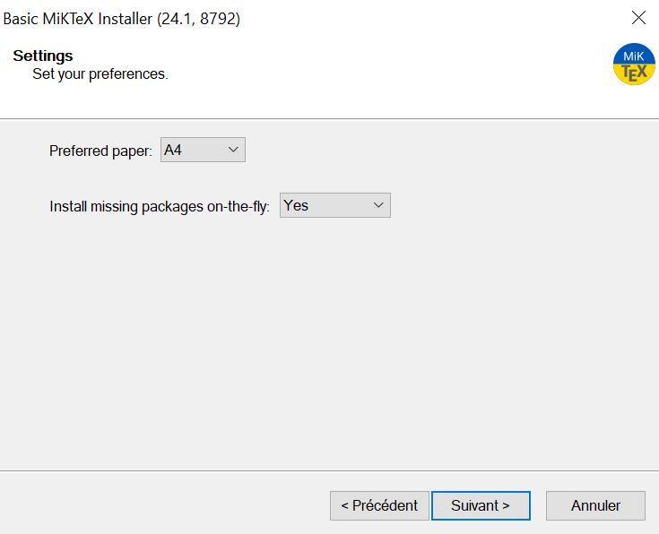
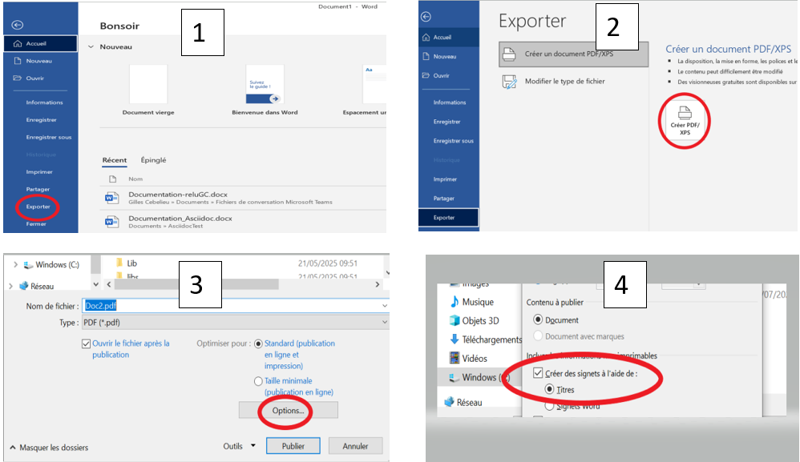
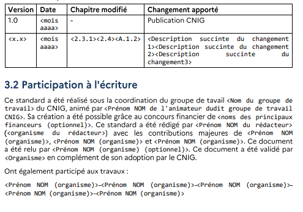
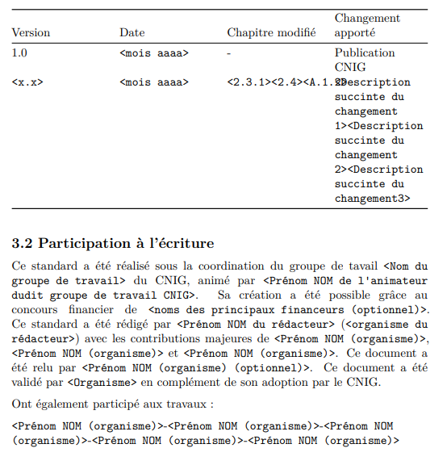
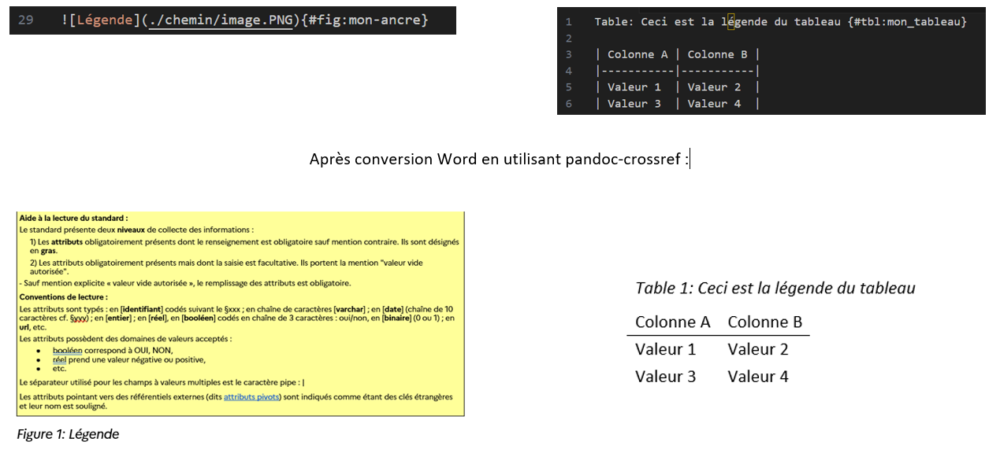
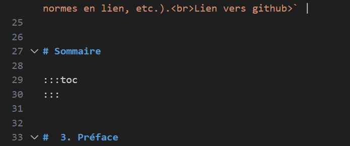
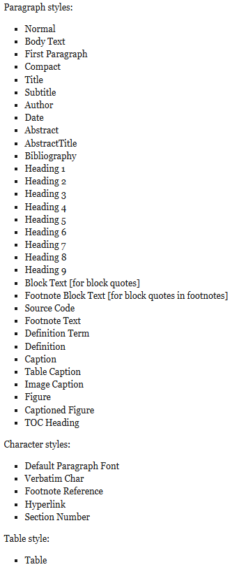
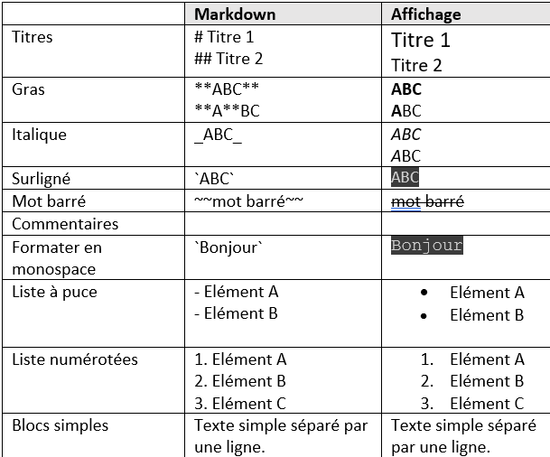
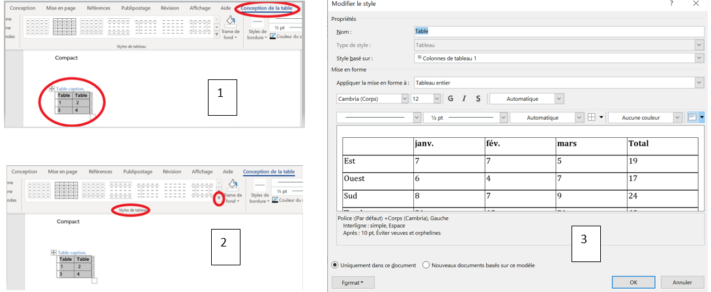

# Documentation de la conversion Markdown vers Word / PDF


# Introduction 

Cette documentation décrit le processus complet permettant de convertir un document rédigé au format Markdown en un document finalisé au format Word ou PDF. Elle explique également comment intégrer une page de garde au document final et assurer une mise en page normalisée.


L'objectif est de formaliser ce processus afin de le rendre facilement reproductible. 


Le processus consiste d'abord à préparer l'environnement avec les outils requis puis de structurer les fichiers sources avant de convertir le Markdown en Word en appliquant un modèle de mise en forme. La suite consiste à exporter le document Word en PDF, à compiler la page de garde LaTeX et enfin de fusionner le tout pour obtenir le document final. La suite de ce document détaille pas à pas ces étapes, les prérequis à installer et les commandes à utiliser.


# Sommaire 

1) [Installations préalables](#installations-préalables)


2) [Ressources pour générer le standard](#ressources-pour-générer-le-standard)


3) [Conversion d'un document Markdown en PDF](#conversion-dun-document-markdown-en-pdf)   
3.a.  [Méthode 1 : Conversion en passant par Word](#méthode-1--conversion-en-passant-par-word)   
3.b.  [Méthode 2 : Conversion directe vers PDF](#méthode-2--conversion-directe-vers-pdf)   
3.c.  [Comparaison des deux méthodes](#comparaison-des-deux-méthodes) 


4) [Utilisation et adaptation du modèle de standard](#utilisation-et-adaptation-du-modèle-de-standard)  
4.a.  [Comment utiliser le modèle : "Document.md" ?](#comment-utiliser-le-modèle--documentmd-)      
4.b.  [Comment générer automatiquement une numérotation et une liste des figures et tableaux ?](#comment-générer-automatiquement-une-numérotation-et-une-liste-des-figures-et-tableaux-)    
4.c.  [Comment générer une table des matières ?](#comment-générer-une-table-des-matières-)   
4.d.  [Comment adapter sa mise en page ?](#comment-adapter-sa-mise-en-page-)   
4.e.  [Comment adapter la page de garde de son document ?](#comment-adapter-la-page-de-garde-de-son-document-) 


# Installations préalables 

! Attention aux versions des outils que vous utilisez. Certaines posent des problèmes de compatibilité. En cas de doute, utilisez les versions indiquées dans la documentation. !


- Installez l'outil Pandoc (https://github.com/jgm/pandoc/releases/tag/3.7.0.2).

Pandoc est le convertisseur universel de formats de documents.


- Installez l'outil pandoc-crossref (https://github.com/lierdakil/pandoc-crossref/releases/tag/v0.3.20).

Pandoc-crossref est un filtre pour Pandoc qui ajoute aux documents des fonctions de numérotation automatique et de références croisées pour les tables et les figures. Il est préférable de le télécharger dans le même dossier que celui de votre pandoc. 


- Installez l'outil Visual Studio Code (https://code.visualstudio.com/).

Utile pour avoir un environnement de travail en local et visualiser les changements effectués sur les documents.


- Installez Python (ex version : 3.13.3) (https://www.python.org/downloads/). 

Utile pour préparer votre document avant ou après la conversion, en automatisant des tâches.


- Installez MiKTeX (https://miktex.org/download)  >  Cochez "Yes" pour "Install missing packages on-the-fly" (voir image ci-dessous). 




Utile pour gérer la compilation LaTeX de la page de garde.


# Ressources pour générer le standard 

`Document.md`

- c’est le document principal rédigé en Markdown qu'on convertira avec Pandoc.

- il contient le texte structuré, les titres, les images, etc.


`README.md`

- c’est la documentation d’explication

- elle sert de guide technique, pour expliquer comment utiliser tous ces fichiers et reproduire le processus de conversion.
  

`page_de_garde.tex`

 - c’est le fichier LaTeX de la page de garde

- il définit la présentation de la couverture (titres, logos, date, etc.)

- il est compilé avec pdflatex pour produire la page de garde en PDF.
  

`Dossier modele :` 

1. `Modele-styles.docx`

- c’est un modèle Word qui contient la mise en forme standardisée (styles de titres, pieds de page, en-têtes, etc.)

- Pandoc l’utilise comme référence pour appliquer la bonne mise en page quand il convertit ton Markdown en Word.
  

2. `move-toc.lua`

- il s'agit d'un filtre Lua pour Pandoc

- il insère un champ TOC (table of contents : table des matières) Word dynamique à l'endroit marqué :::toc, en insérant directement le XML Word.


3. `post-traitement.py`

- il s'agit d'un script Python

- il modifie un document .docx après sa génération

- il règle la police de tous les tableaux à la taille 9 pt

- il supprime tout le contenu situé avant le titre "FICHE DESCRIPTIVE"

- il ajuste automatiquement le contenu des tableaux.


`Dossier ressources :`

- le dossier contient : les logos, illustrations, schémas ...
    

`Dossier ressources_documentation`


# Conversion d'un document Markdown en PDF 


## Méthode 1 : Conversion en passant par Word 


Nous allons maintenant aborder les différentes étapes pour convertir un document Markdown en un document PDf. Ces étapes doivent être réalisé dans un terminal de commande (de préférence GitBash).


### Etape 1 : Conversion du Markdown en un document Word


````
pandoc -s -f markdown -t docx --toc --toc-depth=3 --lua-filter=./modele/move-toc.lua --filter pandoc-crossref -o Document.docx --reference-doc=./modele/Modele-styles.docx Document.md
````
- "pandoc" est un outil très puissant pour convertir des documents d’un format à un autre.

- "s" (standalone) indique de produire un document complet (pas un fragment). Par exemple, en DOCX, cela génère un fichier Word complet.

- "f markdown" est le format d’entrée : Markdown Standard, donc le fichier source Document.md est interprété avec la syntaxe Markdown.

- "t docx" est le format de sortie : DOCX (fichier Word).

- "--toc" ajoute une table des matières au document.

- "--toc-depth=3" indique de prendre en compte les titres de niveaux 1, 2 et 3 pour la table des matières.

- "--lua-filter=move-toc.lua" permet de copier la table des matières et de la déplacer là où on le souhaite.

- "--filter pandoc-crossref" permet la numérotation automatique et les références croisées de tables et figures. 

- "-o Document.docx" indique le fichier de sortie : ici Document.docx.

- "--reference-doc=./modele/Modele-styles.docx" indique un modèle Word (Modele-styles.docx) que Pandoc va utiliser pour reprendre les styles, polices, etc. Cela permet d’obtenir un rendu conforme à une charte graphique.

- "Document.md" correspond au fichier source Markdown à convertir.


### Etape 2 : Post-traitement Word


````
python ./modele/post-traitement.py Document.docx
````


- Cette étape de post-traitement permet de réduire la taille de la police des tableaux à 9 pt.

- Lors de l'étape 2, "--toc" permet d'ajouter un toc, situé par défaut au début du document. Pour le déplacer où on la souhaite, il est nécessaire d'utiliser le filtre lua vu précédement et puis ensuite de supprimer le toc du début (pour ne pas avoir un doublon). C'est cette dernière étape que réalise en autre cette ligne de commande.
  
- Cette étape permet aussi d'ajuster automatiquement le contenu des tableaux.

### Etape 3 : Exporter le Word en PDF


Sous-étape 1 : Ouvrir le Document.docx généré -> Cliquer dans la table des matières vide après le titre Sommaire -> Cliquer sur "Mettre à jour la table".

Sous-étape 2 : Fichier Document.docx -> Exporter -> Créer PDF -> Options -> Cocher créer des signets à l'aide de "Titres" -> Publier




- Cette étape permet d'afficher et de mettre à jour la table des matières et puis d'exporter le document .docx en document .pdf tout en permettant la conservation de cette table.


### Etape 4 : Conversion de la page de garde Latex en PDF
<span id="etape5"></span>


````
xelatex page_de_garde.tex
````
- "xelatex" est un compilateur LaTeX qui transforme le fichier source page_de_garde.tex en un fichier PDF.


### Etape 5 : Suppression des fichiers auxiliaires
<span id="etape6"></span>


````
rm -f page_de_garde.{aux,log,out}
````
- la commande "rm" supprime les fichiers auxiliaires générés par LaTeX comme : page_de_garde.aux , page_de_garde.log , page_de_garde.out. Ces fichiers contiennent des informations de compilation qui encombrent inutilement le répertoire.


### Etape 6 : Fusion de la page de garde et du document principal
<span id="etape7"></span>


````
qpdf --empty --pages page_de_garde.pdf Document.pdf -- document_final.pdf
````
- "qpdf --empty --pages page_de_garde.pdf Document.pdf -- document_final.pdf" permet de fusionner le fichier latex de la page de garde avec le document principal.


## Méthode 2 : Conversion directe vers PDF 


Nous pouvons également convertir directement le fichier Markdown en PDF. Cette méthode présente l’avantage d’être plus concise et de comporter moins d’étapes intermédiaires que la précédente. 


Cependant, la mise en page ne sera pas personnalisée puisque cette méthode ne dispose pas d'un document Word pour choisir le style. Ainsi, cette méthode est pour l’instant à utiliser avec précaution et mérite d’être développée davantage par la suite.


### Etape 1 : Conversion du Markdown en un document .pdf


````
pandoc Document.md -o Document.pdf --pdf-engine=xelatex
````
- "Document.md" correspond au fichier source Markdown à convertir.
- "-o Document.pdf" indique le fichier de sortie : ici Document.pdf.
- "--pdf-engine=xelatex" est une option qui précise quel moteur LaTeX utiliser pour produire le PDF. Par défaut, Pandoc ne crée pas directement de PDF. Il transforme d'abord le Markdown en Latex, puis utilise un moteur Latex pour le compiler en pdf.


### Etape 2 : Conversion de la page de garde Latex en PDF
[(voir ci-dessus)](#etape5).


### Etape 3 : Suppression des fichiers auxiliaires
[(voir ci-dessus)](#etape6).


### Etape 4 : Fusion de la page de garde et du document principal
[(voir ci-dessus)](#etape7).


## Comparaison des deux méthodes 

**Méthode 1 :**


Cette image correspond au rendu dans Word, obtenue après l'application de la méthode 1 décrite en amont.





**Méthode 2 :**


Cette image correspond au rendu dans PDF, obtenue après l'application de la méthode 2 décrite en amont.





# Utilisation et adaptation du modèle de standard  
## Comment utiliser le modèle : "Document.md" ? 

- Ce modèle de standard est une ossature sur laquelle vous pourrez vous appuyer pour écrire votre standard conformément aux normes d'écritures en vigueur et aux bonnes pratiques du CNIG

- Si une partie ou section est optionnelle, cela sera indiqué. Autrement, elle devra apparaître dans votre standard.

- Les aides et explications sont `surlignés` et entourés des symboles <>. Ls exemples sont seulement `surlignés` (si vous choisissez de reprendre le texte de l'exemple, retirez le surlignage).


## Comment générer automatiquement une numérotation et une liste des figures et tableaux ? 

### Utilisations du filtre pandoc-crossref

#### Numérotation automatique des figures et des tableaux 

Pandoc-crossref est un filtre pour Pandoc qui ajoute aux documents des fonctions de numérotation automatique et de références croisées pour les tables et les figures.

Concrètement, lorsque vous écrivez dans le document Document.md vos tableaux et figures, après conversion pandoc, cela affiche automatiquement la numérotation comme ceci :  




! Attention : pour que pandoc-crossref fonctionne normalement, il faut impérativement respecter la syntaxe d'écriture Markdown de vos tableaux et figures comme indiquée dans l'image ci-dessus !

#### Génération automatique de listes de figures et de tableaux 

Pandoc-crossref permet également de générer automatiquement une liste de figures et une liste de tableaux avec leur numérotation et leur légende dans le document Markdown.

Il suffit d'insérer des balises spéciales dans le document Markdown à l'endroit où vous voulez que la liste apparaisse :  

- Pour la liste des figures :

`\listoffigures`

- Pour la liste des tableaux : 

`\listoftables`


## Comment générer une table des matières ? 

L'option de la ligne de commande Pandoc "--toc --toc-depth=3" permet de générer par défaut au début du document un sommaire qui reprend les titres et sous-titres du même document. 

"depth=3" indiqe le niveau maximal de titres à inclure, dans cet exemple il est préréglé à 3. 


Cependant, il existe une méthode pour copier et déplacer la table des matières à l'endroit que l'on souhaite. Il faut dans le document Markdown insérer une balise à l'endroit voulu :



Ensuite, en appliquant le filtre Lua on insère à la place de cette balise la table des matières et en appliquant le script python "post-traitement.py" on supprime celle du début pour ne garder que celle bien située.


## Comment adapter sa mise en page ? 

Le fichier "Modele-styles.docx" est un document Word utilisé comme modèle de mise en forme lors de la conversion de Document.md en .docx. Pandoc s’appuie sur les styles définis dans ce modèle pour les appliquer automatiquement au document généré.

Pour adapter sa mise en page, il suffit de modifier dans le modèle les styles recensés ci-dessous :



Pour plus d'informations, vous pouvez consulter le lien suivant : https://pandoc.org/MANUAL.html#option--reference-doc

### En-têtes 

Le modèle contient des styles prédéfinis pour les en-têtes et pieds de page. Lors de la conversion, Pandoc applique automatiquement ces styles, ce qui garantit une uniformité sur toutes les pages. 

Pour personnaliser les en-têtes, modifiez-les directement. Vous pouvez y insérer des numéros de pages ou toute autre information répétée.

### Style titres et texte 

Voici un tableau résumant la syntaxe de base du langage Markdown.



- Pour aller à la ligne (sans sauter de ligne), appuyez deux fois sur la touche espace puis appuyez sur la touche Entrée.  
Utilisez < br > pour aller à la ligne suivante (sans sauter de ligne) si vous êtes dans un tableau.

Pour plus d'informations, vous pouvez consulter la documentation Markdown sur Github : https://docs.github.com/fr/get-started/writing-on-github/getting-started-with-writing-and-formatting-on-github/basic-writing-and-formatting-syntax

Votre modèle de référence Word définit des styles pour les différents niveaux de titres (Titre 1, Titre 2, Titre 3, etc.) ainsi que pour le corps du texte (Normal). Pour que la conversion applique correctement les styles, veillez à utiliser ces styles dans votre Markdown via la hiérarchie des titres (#,##,###), que Pandoc associera aux styles correspondants dans Word. Il est aussi possible de personnaliser la police, la taille, l'interligne et les couleurs en modifiant le modèle.


### Mise en page des tableaux 

Les tableaux dans le document converti adoptent le style défini dans le modèle Word, notamment en termes de bordures, remplissage du fond, l'alignement horizontal (centré, gauche, droite), l'alignement vertical (haut,centre,bas) et l'espacement des cellules. Attention tout de même, quand Pandoc génère un .docx, applique par défaut le style de tableau nommé Table à tous les tableaux et ne prend pas en considération les autres styles.

Pour ajuster la présentation des tableaux dans le Word de référence : 

- Insertion > Tableau
- Sélectionnez le tableau en entier
- Cliquez sur l'onglet Conception de la table
- Repérez la section Styles de tableau
- Cliquez sur la petite flèche en bas pour ouvrir le panneau des styles
- Allez sur Modifier le style de tableau ...
- Modifiez le style du tableau à votre convenance
- Cliquez sur ok.





D'autres fonctionnalités comme les répétitions des titres des colonnes lors des changements de page sont disponibles en cliquant sur le bouton Format.

En ce qui concerne le style du texte des cellules du tableau, vous ne pouvez pas le changer dans Table mais vous pouvez le faire avec le style Compact (qui est aussi le style utilisé pour les listes).


### Mise en page des légendes 

Vous pouvez choisir le style de vos légendes en modifiant dans le Word de référence les styles : - d'Image Caption (pour les légendes des figures/images) ou - de Table Caption (pour les légendes des tables).

Pandoc adopte ce style uniquement si vous écrivez dans le Document.md :

- pour la légende d'une figure/image : 

`{#fig:mon-ancre}`    


- pour la légende d'une table :  

`Table: La légende {tbl:mon_tableau}`

`| a | b |`  
`|---|---|`  
`| 1 | 2 |`


## Comment adapter la page de garde de son document ? 

Le fichier page_de_garde.tex est un fichier LaTeX qui inclut la configuration et le contenu de la page de garde.

Ce fichier contient les packages et paramètres LaTeX qui définissent la mise en forme générale de la page de garde :

-  `\usepackage{geometry} avec margin=2.5cm` définit les marges

Il contient également le contenu avec les différents titres, sous-titres, logos etc. Pour personnaliser cette page de garde, vous pouvez :

- Remplacer les chemins des images par les vôtres,
- Si vous avez plusieurs sponsors, ils pourront être indiqués en partie 1.2,
- Préférer un logo officiel en format PNG (souvent disponible sur le site du collaborateur via le service communication) plutôt qu'une image récupérée sur un moteur de recherche,
- Positionner Le logo du sponsor à la même hauteur que le logo du CNIG.
  
- Modifier les titres, sous-titres, textes,
- Choisir librement la police de votre texte,
- Adapter la taille de la police (Huge, Large ...),
- Choisir la couleur de votre texte avec : `\definecolor{etatbleu}{RGB}{15,36,62}`

- Adpater les espacements en cm. 
- Une page blanche est insérée avec `\newpage \thispagestyle{empty} \mbox{} \newpage` pour séparer la page de garde du reste du document pour l'impression.
